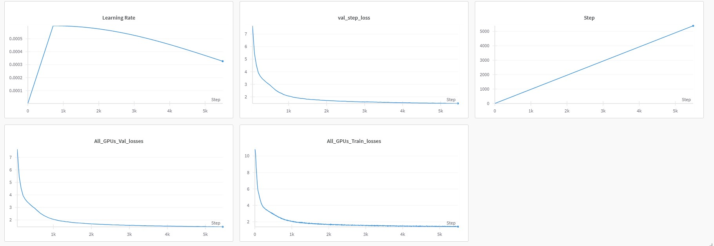
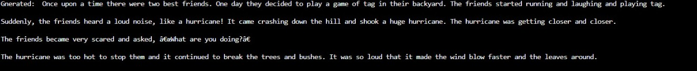

# Introducing StoryLlama - A Smaller Language Model for Bedtime Stories! 

- So, I trained a Llama a 88M architecture I coded from ground up to build a small instruct model, going through the below-mentioned stages from scratch.
- Trained on TiyStories dataset form HuggingFace consisting of 4B tokens for a total of 5000 steps


 ###  Pretraining

#### Dataset

 - I used the [TinyStories](https://huggingface.co/datasets/roneneldan/TinyStories) dataset from HuggingFace.

  1) Train dataset - 2 M records approx
  2) Val dataset - 26K records approx


---

####  ModelArgs (Hyperparameters)


Below is a table summarizing the configuration parameters for the model:

| Parameter                      | Description                                                                 | Default Value                     | Type      |
|--------------------------------|-----------------------------------------------------------------------------|-----------------------------------|-----------|
| `epochs`                       | Number of training epochs                                                   | `4`                               | `int`     |
| `block_size`                   | Size of each block (context length)                                         | `512`                             | `int`     |
| `batch_size`                   | Batch size for training                                                    | `64`                              | `int`     |
| `inference`                    | Inference mode (not specified)                                              | `None`                            | `None`    |
| `embeddings_dims`              | Dimensionality of embeddings                                                | `512`                             | `int`     |
| `attn_dropout`                 | Dropout rate for attention layers                                           | `0.1`                             | `float`   |
| `no_of_heads`                  | Number of attention heads                                                   | `8`                               | `int`     |
| `dropout`                      | Dropout rate for the model                                                  | `0.1`                             | `float`   |
| `val_epochs`                   | Number of validation epochs                                                 | `2`                               | `int`     |
| `max_lr`                       | Maximum learning rate                                                       | `6e-4`                            | `float`   |
| `no_of_decoder_layers`         | Number of decoder layers                                                    | `8`                               | `int`     |
| `weight_decay_optim`           | Weight decay for the optimizer                                              | `0.1`                             | `float`   |
| `beta_1`                       | Beta 1 for Adam optimizer                                                   | `0.9`                             | `float`   |
| `beta_2`                       | Beta 2 for Adam optimizer                                                   | `0.95`                            | `float`   |
| `clip`                         | Gradient clipping value                                                     | `1.0`                             | `float`   |
| `device`                       | Device to run the model (`cuda` or `cpu`)                                   | `'cuda'`                          | `str`     |
| `no_kv_heads`                  | Number of key-value heads                                                   | `2`                               | `int`     |
| `vocab_size`                   | Size of the vocabulary                                                      | `50304`                           | `int`     |
| `eps`                          | Epsilon value for numerical stability                                       | `1e-5`                            | `float`   |
| `dtype`                        | Data type for tensors (`bfloat16` if supported, else `float16`)             | `'bfloat16'` or `'float16'`       | `str`     |
| `save_checkpoint_dir`          | Directory to save model checkpoints                                         | `"checkpoints"`                   | `str`     |
| `prompt`                       | Default prompt for inference                                                | `"Once upon a time"`              | `str`     |
| `save_checkpoint_iter`         | Save checkpoint every N iterations                                         | `50`                              | `int`     |
| `total_iters`                  | Total number of training iterations                                        | `10000`                           | `int`     |
| `eval_iters`                   | Evaluate model every N iterations                                          | `50`                              | `int`     |
| `eval_check`                   | Check evaluation metrics every N iterations                                | `100`                             | `int`     |
| `warmup_iters`                 | Number of warmup iterations for learning rate scheduling                   | `700`                             | `int`     |
| `min_lr`                       | Minimum learning rate (10% of `max_lr`)                                     | `0.1 * max_lr`                    | `float`   |
| `lr_decay_iters`               | Number of iterations for learning rate decay                               | `10000`                           | `int`     |
| `total_batch_size`             | Total batch size across all devices                                         | `524288`                          | `int`     |
| `micro_batch_size`             | Micro batch size per device                                                | `batch_size`                      | `int`     |
| `gradient_accumulation_steps`  | Gradient accumulation steps                                                 | 524288 | `int` |
---
#### Hardware Setup

 - Used DPP using Pytorch torchrun consisting of 2x GeForce RTX A100 AXM (80gb VRAM each) rented on runpod.io
 - The model is a 0.768GB in size but needs around 4 GB of VRAM when loaded in fp32 precision
---

#### Frameworks:
**Pytorch**


--- 

#### Epochs/Steps
- Iterations (train) = 5k 

- Val iterations = every 50 steps
---

#### Losses
- Train loss - 1.43

- Val loss - 1.45

---

#### Screenshots of the loss curves

- Loss Curves (Train and Val)



--- 
#### Output

- Prompt: Once upon a time



---

### Local setup


### Requirements


```python
git [clone the repo](https://github.com/YuvrajSingh-mist/StoryLlama.git)
cd StoryLlama
bash ./install.sh

```
- A wandb.ai account for plotting graphs for your loss curves

- On your terminal run
```python
wandb login
```

- Enter the api key and follow the instructions and once you are succesfully logged in follow the given steps


- Download the model

```python
cd gradio/

python app.py
```


---

### Running 


#### Training a model

- Kindly change 'device' to any of your available cuda gpus.

To run:

```python
bash ./install.sh
```

```python
torchrun --standalone --nproc_per_node=gpu trainer.py \
    --epochs 10 \
    --block_size 256 \
    --batch_size 128 \
    --embeddings_dims 768 \
    --attn_dropout 0.2 \
    --no_of_heads 12 \
    --dropout 0.2 \
    --val_epochs 3 \
    --max_lr 5e-4 \
    --no_of_decoder_layers 6 \
    --weight_decay_optim 0.01 \
    --beta_1 0.85 \
    --beta_2 0.99 \
    --clip 0.5 \
    --device "cuda" \
    --no_kv_heads 4 \
    --vocab_size 50257 \
    --eps 1e-6 \
    --dtype "float16" \
    --save_checkpoint_dir "model_checkpoints" \
    --prompt "Once upon a time" \
    --save_checkpoint_iter 100 \
    --total_iters 5000 \
    --eval_iters 200 \
    --eval_check 500 \
    --warmup_iters 1000 \
    --min_lr 1e-5 \
    --lr_decay_iters 2000 \
    --total_batch_size 262144 \
    --micro_batch_size 128 \
    --gradient_accumulation_steps 4

```
--standalone - if all the gpu are on one server
--npro_per_node - number of gpus available and use the keyword gpu to use all

#### Inference on a model

```python 
python inference.py --prompt "Once upon a time" --max_length 100 --temperature 0.8 --topk 50 
```

